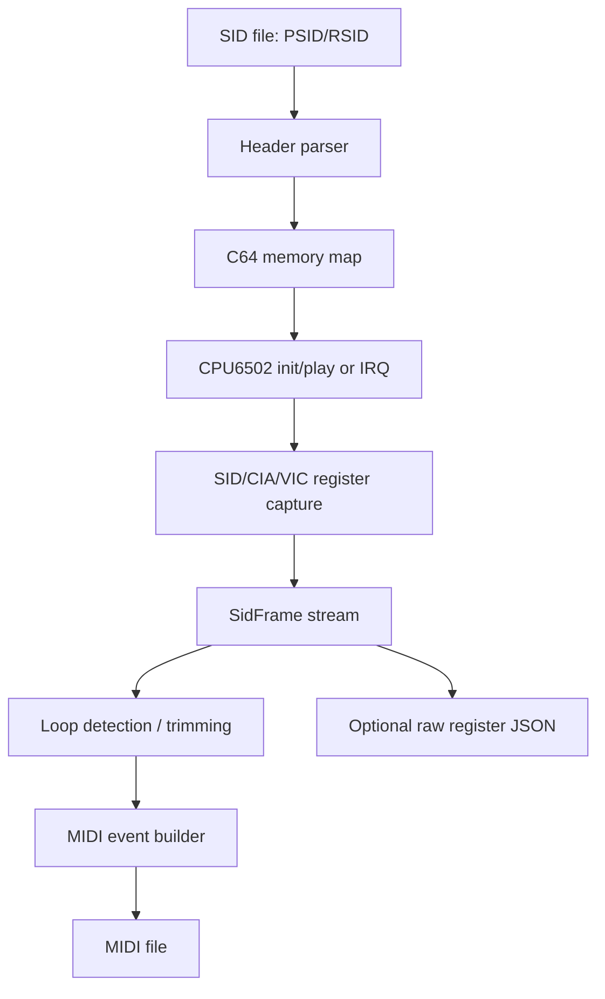

# Architecture Deep Dive

This document explains how the pieces fit together.

## 1. SID parser

The parser extracts:

- PSID/RSID version
- load/init/play addresses
- song count and default song
- speed flags
- video standard hint
- SID chip model hints
- 2SID/3SID address hints when available

## 2. Memory map

The C64 host model owns RAM, ROM images, SID register windows, CIA/VIC state and bank switching.

Banking is derived from the CPU-side 6510 port state. This avoids split-brain where the CPU thinks `$0001` has one value and the memory map uses another.

## 3. CPU execution

`CPU6502` executes init and repeated play/IRQ calls. Every memory write goes through the host callback, so writes to `$D400-$D7FF`, `$DC00-$DDFF` and `$D000-$D3FF` can be captured.

## 4. CIA/VIC timing model

The runtime is instruction-level and frame/call based. It is not per-PHI2.

- Timer A/B latches are tracked.
- ICR bits are approximated for SID playback.
- `pre_irq_latch` is the default timing order.
- `post_call` is available for stricter experiments.

## 5. SidFrame stream

Each frame contains:

- primary SID registers
- primary trigger/gate state
- primary trigger cycle
- second SID registers/state when present
- third SID registers/state when present
- digi/write-count metadata

Internally, conversion normalizes legacy tuples to canonical `SidFrame` at API boundaries.

## 6. MIDI conversion

MIDI construction uses deterministic event ordering:

1. meta
2. program
3. CC/bend
4. note-off
5. note-on

This fixes same-tick retrigger articulation.

## 7. Batch layer

The Top-100 scripts resolve HVSC paths, run `sid2midi.py`, validate note counts, probe alternate subtunes, write manifests and keep output directories clean.

